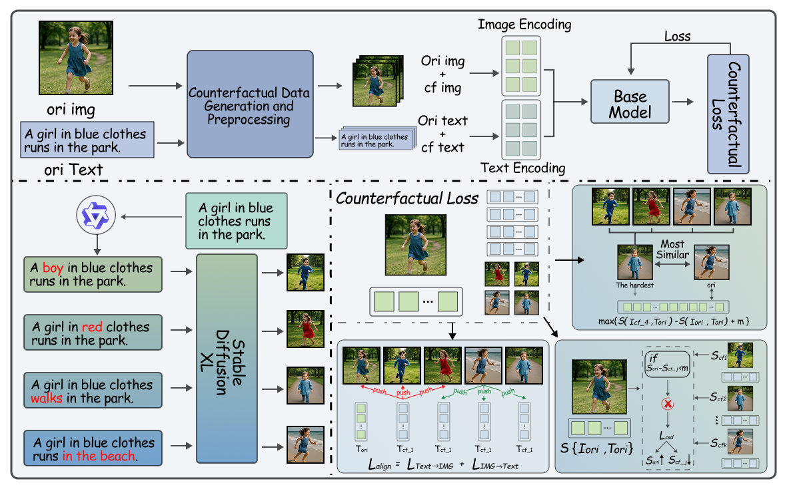

# CF-VLM : CounterFactual Vision-Language Fine-tuning
> Official code for the NeurIPS 2025 paper [“CF-VLM : CounterFactual Vision-Language Fine-tuning”](https://arxiv.org/abs/2506.17267).  
<div align="center">

</div>

[English](README.md) | [中文](README_zh.md)


---

## Abstract

Recent years have witnessed remarkable progress in Vision-Language Models (VLMs) for cross-modal semantic understanding. However, they still struggle with fine-grained discrimination and deep causal reasoning tasks. Existing VLMs often rely on surface-level statistical correlations, failing to capture the causal logic between vision and text.  
To address this, we propose **CounterFactual Vision-Language Fine-tuning (CF-VLM)**: by **injecting targeted counterfactual samples**, we enhance model sensitivity to **uniqueness/stability** and **key causal micro-edits**, without disrupting basic cross-modal alignment. This improves compositional reasoning, generalization, and factual consistency. Extensive experiments show that CF-VLM outperforms strong baselines and SOTA methods across multiple reasoning benchmarks, while also alleviating visual hallucination. Please refer to the paper for theoretical details and full experiments.

---

## Table of Contents
- [Installation](#installation)
- [Environment Requirements](#environment-requirements)
- [Data Preparation](#data-preparation)
- [Project Structure](#project-structure)
- [Quick Start](#quick-start)
- [Training](#training)
- [Inference & Evaluation](#inference--evaluation)
- [FAQ](#faq)
- [License](#license)
- [Citation](#citation)
- [Acknowledgement](#acknowledgement)
- [Contact](#contact)

---

## Installation

1. Clone the repository
   ```bash
   git clone https://github.com/your_org/CF-VLM.git
   cd CF-VLM
   ```

2. (Optional) Create a virtual environment
   ```bash
   python3 -m venv .venv
   source .venv/bin/activate      # Linux / macOS
   # .\.venv\Scripts\activate  # Windows PowerShell
   ```

3. Install dependencies
   ```bash
   pip install -r requirements.txt
   ```

4. Configure the Qwen2.5-VL inference model  
   Please follow the official documentation for deployment and API setup:  
   👉 Qwen official documentation: https://github.com/QwenLM/Qwen3-VL  

---

## Environment Requirements

- Python **3.9+**
- PyTorch **2.1+**
- CUDA **11.8+**
- NVIDIA GPU (A100/80GB recommended)
- Dependencies listed in `requirements.txt`

---

## Data Preparation

Run `process.py` to generate counterfactual data:
```bash
python process.py --input_path data/raw --output_path data/counterfactual --num_workers 8 --seed 42
```

---

## Project Structure

```
CF-VLM/
├─ process.py
├─ clip_train.py
├─ Qwen_train.py
├─ inference.py
├─ requirements.txt
├─ configs/
│   ├─ data.yaml
│   ├─ clip.yaml
│   ├─ qwen.yaml
│   └─ infer.yaml
├─ README.md
└─ README_zh.md
```

---

## Quick Start

1. Generate counterfactual data
   ```bash
   python process.py
   ```

2. Train CLIP model
   ```bash
   python clip_train.py
   ```

3. Train Qwen model
   ```bash
   python Qwen_train.py
   ```

---

## Citation

If you find this project useful, please cite:
```bibtex
@article{cfvlm2025,
  title={CF-VLM: CounterFactual Vision-Language Fine-tuning},
  author={Your Name et al.},
  journal={NeurIPS},
  year={2025}
}
```
